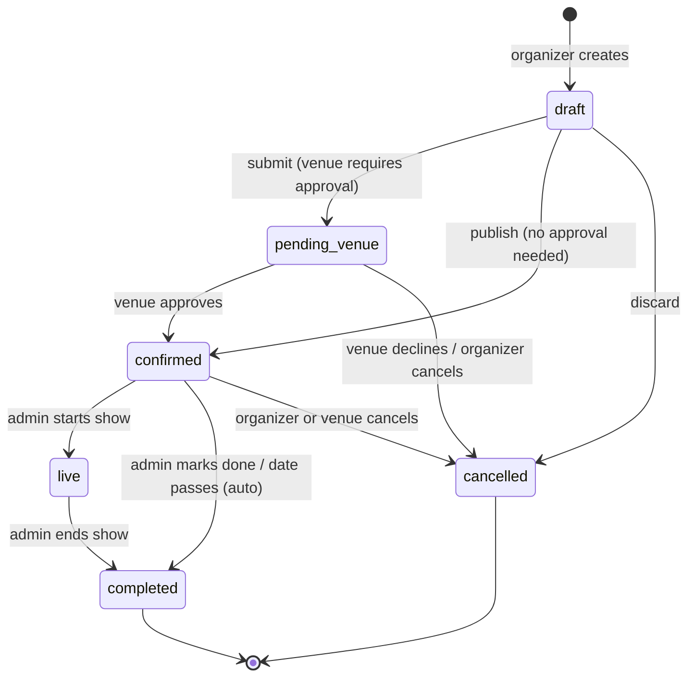

# Party status (lifecycle) — requirement spec

**Status:** Draft · captured 2026-08-12 · roadmap phase: **Soundcheck** (Phase 0) · **keystone**

## Purpose
One field that captures where a toque is in its life — from idea to history — so
approvals, live mode, applause, discovery, and notifications all read from a
single source of truth instead of inferring state from scattered flags and dates.

## States
`party.status` enum, default `draft`:

| State | Meaning | Visible to | Signups |
|---|---|---|---|
| `draft` | organizer still setting it up | creator + party admins | closed |
| `pending_venue` | submitted, awaiting the venue's decision *(only when the venue requires approval)* | creator/admins + venue admins | closed |
| `confirmed` | scheduled & public — the "upcoming toque" state | everyone | **open** |
| `live` | happening now; live mode active, applause open | everyone | closed |
| `completed` | finished; now history | everyone (as past) | closed |
| `cancelled` | called off (terminal) | hidden from public; prior RSVPs notified | closed |

Notes:
- `pending_venue` only appears when the venue requires approval (a venue-level
  setting from the venue-metadata / approval work). Otherwise `draft → confirmed`.
- "Declined by venue" is `cancelled` with a reason (`venue_declined`) rather than
  a separate state — keeps the set small. Split it out later if the organizer UX
  needs to distinguish it.

## Transitions


Who can trigger:
- **Organizer / party admin:** submit, publish, start show, end show, mark done, cancel, discard.
- **Venue admin:** approve / decline a `pending_venue` toque; cancel a confirmed one at their venue.
- **System (optional):** auto-complete a `confirmed` toque after its date passes (see Open decisions).

Terminal states (`completed`, `cancelled`) don't reopen — clone into a new draft instead.

## What reads status (consumers)
- **Discovery / home "upcoming"** — `status = 'confirmed' AND date >= now`.
- **Signups open?** — `status = 'confirmed'`. In-event additions happen via live mode's "add on the fly," not public signup.
- **Live mode / admin console** — *Start show* enabled in `confirmed`; console runs in `live` (see `live-mode.md`).
- **Applause window** — opens at `live`, closes at `completed` + grace (see `applause.md`).
- **Venue approval queue** — `status = 'pending_venue'`.
- **Notifications** — fire on transitions: confirmed ("your toque is on"), pending_venue ("event awaiting your approval"), live ("the show is starting"), plus a day-before reminder for `confirmed`.

## Data model
- `party.status` — enum, `not null default 'draft'`.
- `party.status_changed_at` — timestamptz, for history/notifications.
- `party.cancel_reason` — text/enum, nullable (e.g. `organizer`, `venue_declined`).
- **Folds in the existing `approved_by_venue` flag** — the venue decision is now
  represented by the `pending_venue → confirmed` transition. Keep
  `approved_by_venue` only if an explicit audit flag is still wanted; otherwise
  drop it in favor of status.

## RLS implication (important — changes an existing policy)
Today `party` SELECT is `using (true)` (fully public). Drafts and pending events
must **not** be publicly visible. Narrow SELECT to:

```
status in ('confirmed','live','completed')
  OR created_by = (select auth.uid())
  OR exists (party_admin membership)
  OR exists (venue_admin membership for this party's venue)
```

Ripple: a non-public party's `performance` / `performance_user` rows shouldn't be
public either — those SELECT policies need the same gating (join to the parent
party's visibility). This is the main gotcha of the status model: miss it and
drafts leak.

## Open decisions
- **Auto-complete** — flip `confirmed → completed` when the date passes (needs a
  scheduled job / Edge Function), or leave completion manual and just treat
  past-dated confirmed toques as "past" in queries? Leaning: query-based "past"
  now, add auto-complete later.
- **`declined` as its own state** vs `cancelled` + reason (current choice).
- **Cancel visibility** — do prior RSVPs / signed-up performers get notified on
  cancel? (Recommend yes, once notifications exist.)

## Dependencies / feeds
- **Needs:** a venue "requires approval" setting (from venue metadata / approval
  work) — but can ship with a simple default and refine.
- **Feeds:** venue approval flow, musician approval mode, live mode, applause,
  notifications, discovery. This is the Phase 0 keystone the rest lean on.
